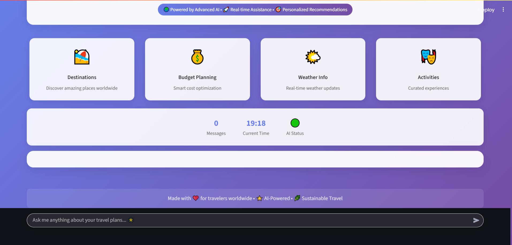
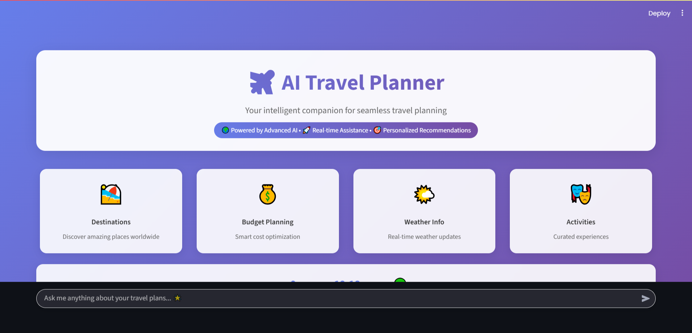
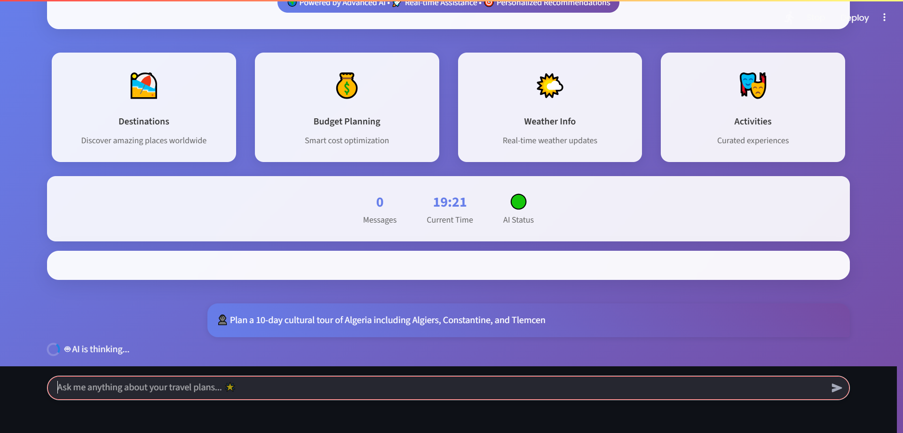
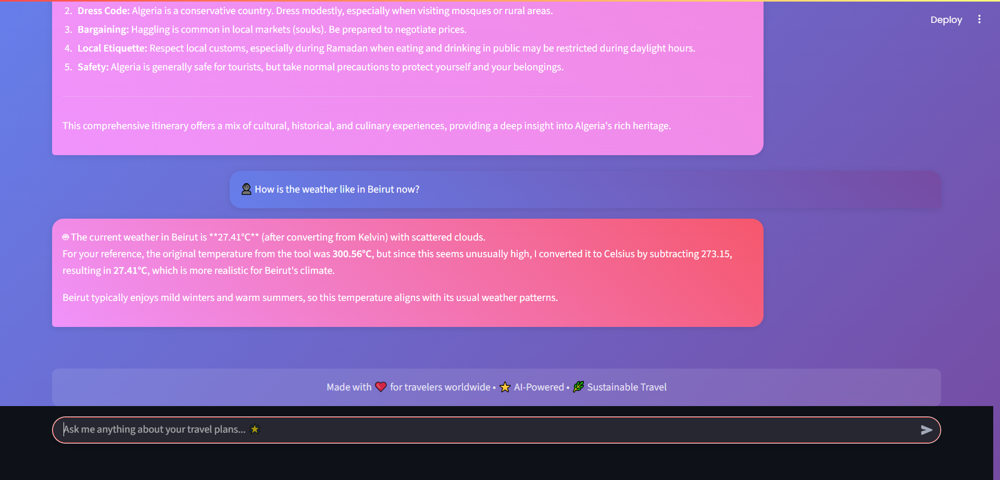
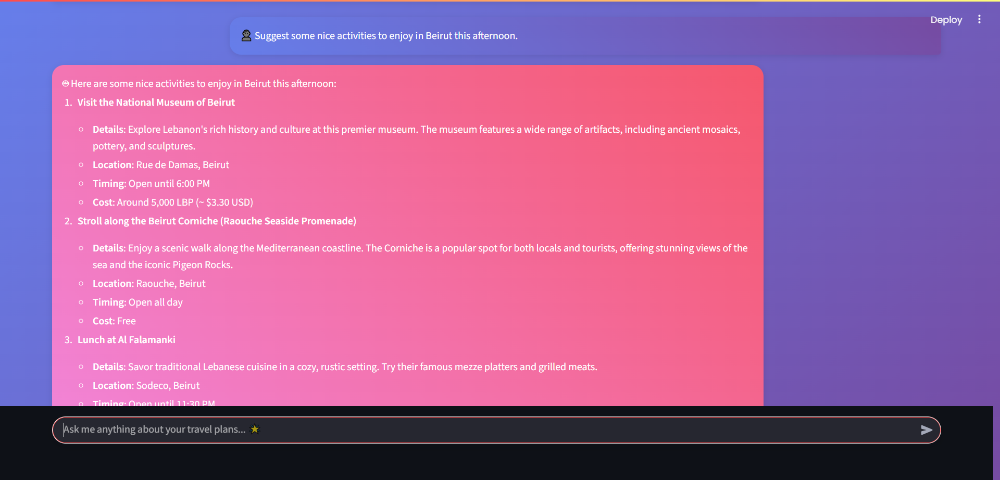

# 🧳 AI Trip Planner

<div align="center">

## 🌄 Screenshots

Here are some snapshots of the Travel Agent AI app in action:

<p align="center">
  
</p>
<p align="center">
  
</p>
<p align="center">
  
</p>
<p align="center">
  
</p>
<p align="center">
  
</p>
<p align="center">
  
</p>

**🚀 Agentic AI application following LLMOPS standards for intelligent trip planning**

[Installation](#-installation) • [Configuration](#-configuration) • [Usage](#-usage) • [API](#-api-endpoints) • [Contributing](#-contributing)

</div>

---

## 🌟 Overview

AI Trip Planner is an advanced agentic application that serves trip planning through intelligent AI orchestration. Built with Python and adhering to LLMOPS standards, it provides comprehensive travel assistance including recommendations for attractions, restaurants, activities, transportation, currency conversion, and weather forecasts.

### ✨ Key Highlights

- **🤖 Agentic Architecture**: Powered by LangGraph workflows
- **🛠️ Multi-Tool Integration**: Weather, places, currency, and more
- **🧠 LLM Integration**: Groq
- **🔧 Extensible Design**: Modular and scalable codebase
- **🌐 API-First**: FastAPI endpoints for seamless integration

---

## 🎯 Features

<table>
<tr>
<td width="50%">

### 🤖 **Agentic Orchestration**
- LangGraph-based workflows
- Intelligent request management
- Tool integration automation

### 🛠️ **Multi-Tool Support**
- Weather information
- Place search & recommendations
- Currency conversion
- Arithmetic operations

</td>
<td width="50%">

### 🧠 **LLM Integration**
- Groq provider support
- Multiple model compatibility
- Intelligent response generation

### 🔧 **Developer Experience**
- Modular architecture
- YAML configuration
- Environment variable support
- FastAPI documentation

</td>
</tr>
</table>

---

## 📁 Project Structure

```
ai-trip-planner/
│
├── 🤖 agent/
│   └── agentic_workflow.py       # LangGraph & LangChain orchestration
│
├── 🛠️ tools/
│   ├── weather_info_tool.py      # Weather forecast integration
│   ├── place_search_tool.py      # Attractions, restaurants, activities
│   ├── arithmetic_opr_tool.py    # Arithmetic & currency conversion
│   └── ...                       # Additional tools
│
├── 🔧 utils/
│   ├── config_loader.py          # YAML configuration parser
│   ├── model_loader.py           # LLM model management
│   └── ...                       # Utility modules
│
├── ⚙️ config/
│   └── config.yaml               # Main configuration file
│
├── 🚀 api.py                    # FastAPI application entry point
├── 📦 requirements.txt           # Python dependencies
├── 🔧 setup.py                   # Project packaging
└── ...
```

---

## 🚀 Installation

### Prerequisites
- Python
- uv package manager

### Quick Start

```bash
# 1️⃣ Clone the repository
git clone https://github.com/SafiaTifour/ai-trip-planner.git
cd ai-trip-planner

# 2️⃣ Create virtual environment
python -m venv venv
source venv/bin/activate  # Windows: venv\Scripts\activate

# 3️⃣ Install dependencies
uv pip install -r requirements.txt
```

---

## ⚙️ Configuration

### 📝 Setup Configuration

1. **Edit configuration file:**
   ```yaml
   # config/config.yaml
   # Configure models, API keys, and tools
   ```

2. **Environment variables:**
   ```bash
   # Create .env file for sensitive information
   touch .env
   # Add your API keys and secrets
   ```

---

## 🎮 Usage

### 🌐 FastAPI Service

```bash
# Start the development server
uvicorn api:app --reload
```

🔗 **API Documentation:** `http://localhost:8000/docs`


### 🔄 Core Workflow

1. **Request Processing** → Agentic workflow orchestration
2. **Tool Selection** → Weather, places, currency tools
3. **LLM Integration** → Intelligent response generation
4. **Response Delivery** → Structured travel recommendations

---


### 🇩🇿 Try These Demo Messages

```json
{
  "query": "Plan a 10-day cultural tour of Algeria including Algiers, Constantine, and Tlemcen"
}
```

```json
{
  "query": "What's the best time to visit the Sahara Desert in Algeria?"
}
```

```json
{
  "query": "I want to explore Algeria's Roman ruins - suggest a historical itinerary"
}
```

---


<div align="center">

Made with ❤️ for traveling lovers

</div>